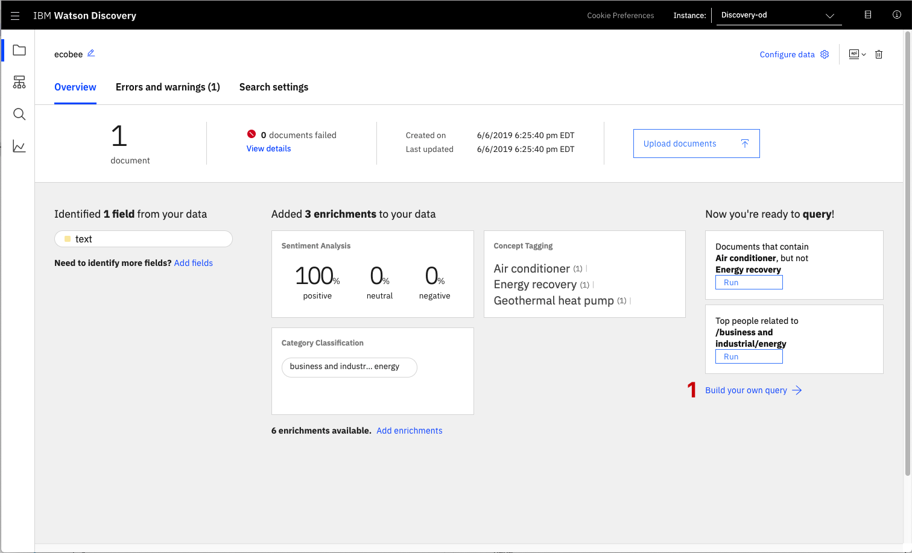
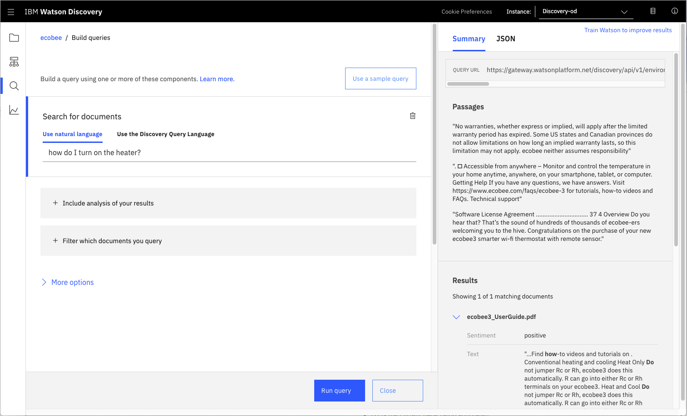
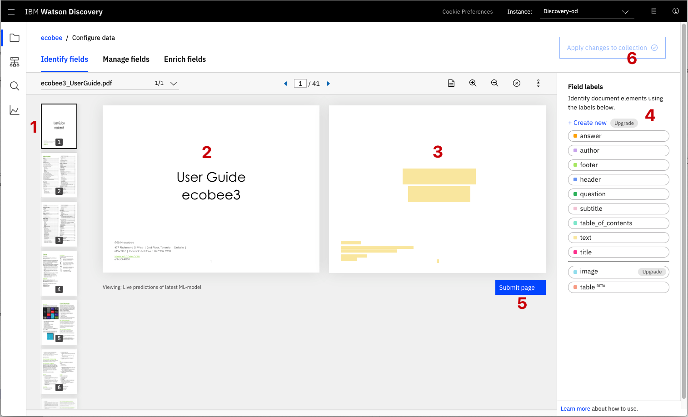
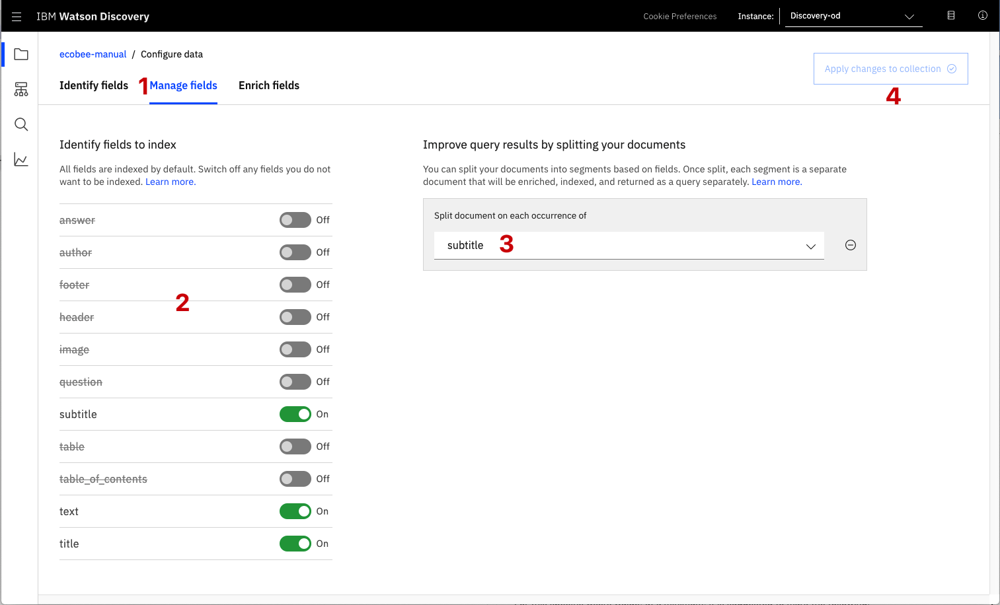
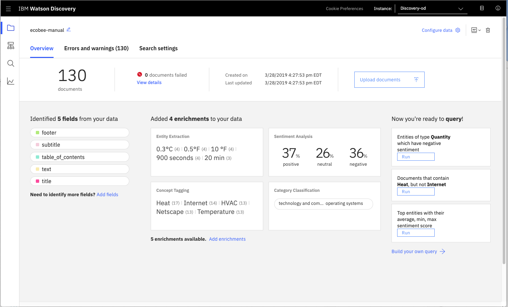
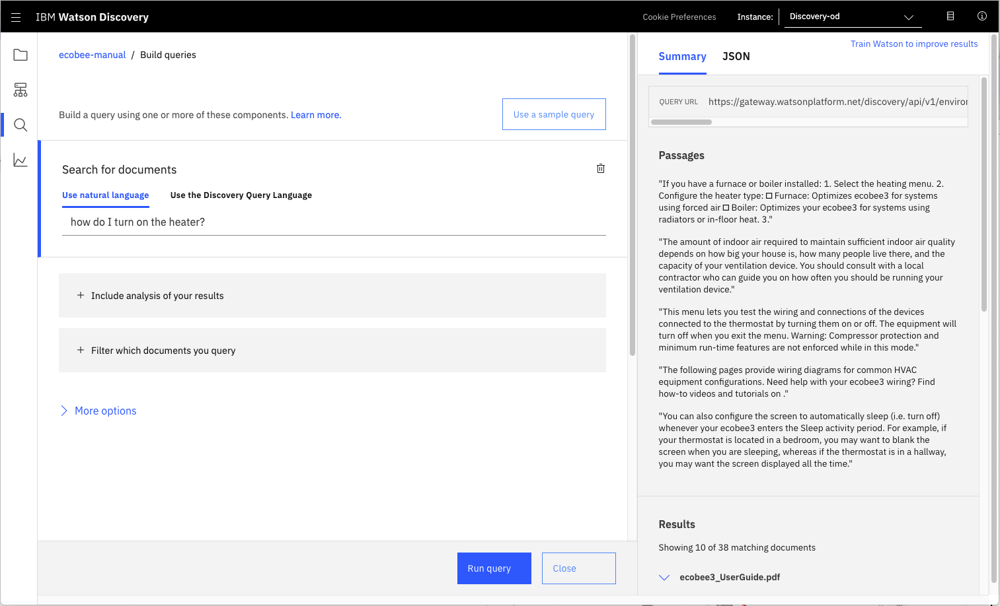

[](https://travis-ci.org/IBM/watson-discovery-sdu-with-assistant)

# Enhance customer helpdesks with Smart Document Understanding

In this code pattern, we walk you through a working example of a web app that utilizes multiple Watson services to create a better customer care experience.

Using the Watson Discovery Smart Document Understanding (SDU) feature, we will enhance the Discovery model so that queries will be better focused to only search the most relevant information found in a typical owner's manual.

## What is SDU?

SDU trains Watson Discovery to extract custom fields in your documents. Customizing how your documents are indexed into Discovery will improve the answers returned from queries.

With SDU, you annotate fields within your documents to train custom conversion models. As you annotate, Watson is learning and will start predicting annotations. SDU models can also be exported and used on other collections.

Current document type support for SDU is based on your plan:

  * Lite plans: PDF, Word, PowerPoint, Excel, JSON, HTML
  * Advanced plans: PDF, Word, PowerPoint, Excel, PNG, TIFF, JPG, JSON, HTML

Here is a great video that provides an overview of the benefits of SDU, and a walk-through of how to apply it to your document:

[](https://www.youtube.com/watch?v=Jpr3wVH3FVA)

## Flow


# Watch the Video

[](https://youtu.be/-yniuX-Poyw)

# Prerequisite 
Create your IBM Cloud account at: https://ibm.biz/BdqQMd
# Steps:

1. [Clone the repo](#1-clone-the-repo)
1. [Create IBM Cloud services](#2-create-ibm-cloud-services)
1. [Configure Watson Discovery](#3-configure-watson-discovery)

### 1. Clone the repo

```bash
git clone https://github.com/fawazsiddiqi/WDiscoverySDU
```

### 2. Create IBM Cloud services

Create the following services:

* [**Watson Discovery**](https://cloud.ibm.com/catalog/services/discovery)

### 3. Configure Watson Discovery

#### Import the document

As shown below, launch the `Watson Discovery` tool and create a new data collection by selecting the `Upload your own data` option. Give the data collection a unique name. When prompted, select and upload the `ecobee3_UserGuide.pdf` file located in the `data` directory of your local repo.


The `Ecobee` is a popular residential thermostat that has a wifi interface and multiple configuration options.

Before applying SDU to our document, lets do some simple queries on the data so that we can compare it to results found after applying SDU.



Click the `Build your own query` [1] button.



Enter queries related to the operation of the thermostat and view the results. As you will see, the results are not very useful, and in some cases, not even related to the question.

#### Annotate with SDU

Now let's apply SDU to our document to see if we can generate some better query responses.

From the Discovery collection panel, click the `Configure data` button (located in the top right corner) to start the SDU process.

Here is the layout of the `Identify fields` tab of the SDU annotation panel:



The goal is to annotate all of the pages in the document so Discovery can learn what text is important, and what text can be ignored.

* [1] is the list of pages in the manual. As each is processed, a green check mark will appear on the page.
* [2] is the current page being annotated.
* [3] is where you select text and assign it a label.
* [4] is the list of labels you can assign to the page text.
* Click [5] to submit the page to Discovery.
* Click [6] when you have completed the annotation process.

As you go though the annotations one page at a time, Discovery is learning and should start automatically updating the upcoming pages. Once you get to a page that is already correctly annotated, you can stop, or simply click `Submit` [5] to acknowledge it is correct. The more pages you annotate, the better the model will be trained.

For this specific owner's manual, at a minimum, it is suggested to mark the following:

* The main title page as `title`
* The table of contents (shown in the first few pages) as `table_of_contents`
* All headers and sub-headers (typed in light green text) as a `subtitle`
* All page numbers as `footers`
* All warranty and licensing infomation (located in the last few pages) as a `footer`
* All other text should be marked as `text`.

Once you click the `Apply changes to collection` button [6], you will be asked to reload the document. Choose the same owner's manual `.pdf` document as before.

Next, click on the `Manage fields` [1] tab.



* [2] Here is where you tell Discovery which fields to ignore. Using the `on/off` buttons, turn off all labels except `subtitles` and `text`.
* [3] is telling Discovery to split the document apart, based on `subtitle`.
* Click [4] to submit your changes.

Once again, you will be asked to reload the document.

Now, as a result of splitting the document apart, your collection will look very different:



Return to the query panel (click `Build your own query`) and see how much better the results are.


